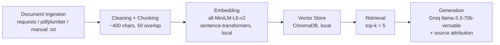

# Project 1 Planning: The Unofficial Guide

> Write this document before you write any pipeline code.
> Your spec and architecture diagram are what you'll use to direct AI tools (Claude, Copilot, etc.) to generate your implementation — the more specific they are, the more useful the generated code will be.
> Update the Retrieval Approach and Chunking Strategy sections if you change your approach during implementation.
> Update this file before starting any stretch features.

---

## Domain

<!-- What domain did you choose? Why is this knowledge valuable and hard to find through official channels? -->

I chose the University of Texas at Dallas, specifically class and professor reviews. I need a RAG system that can pull from a bunch of different sources (reddit, RMP, utdgrades, utdnebula, the galaxy catalog) and give me a real review per class and per professor, taking into account history like difficulty, topics covered, and any changes made to the course over time.

The official UTD catalog (galaxy) tells you what a course is *supposed* to be: credit hours, prereqs, the official description. It will never tell you that a prof's exams are basically impossible without going to every lecture, that a course got way harder after the professor switched, or that the curve is what's actually keeping the GPA at a 3.0. That stuff only lives on RMP, reddit, and in Discords. The system should be able to answer questions like "is CS 4337 hard with Prof X?", "what topics actually show up on the midterm in CS 3345?", and "did the workload change after the professor swap?".

---

## Documents

<!-- List your specific sources: URLs, subreddit names, forum threads, or file descriptions.
     Aim for at least 10 sources that together cover different subtopics or perspectives within your domain. -->

i scoped the corpus to 5 upper-division UTD CS courses that show up a lot on the sub: CS 3345 (data structures), CS 4337 (programming languages), CS 4348 (operating systems), CS 4349 (advanced algorithms), and CS 4347 (database systems). every row below maps to a real file in `documents/` written by `scripts/fetch_initial.py`. the script is re-runnable so the corpus can be refreshed later.

| # | Source | File | Description | URL |
|---|--------|------|-------------|-----|
| 1 | UTD Galaxy catalog | `catalog_cs3345.txt` | Official course description for CS 3345 (data structures). HTML-stripped, nav cruft still in there for now. | https://catalog.utdallas.edu/now/undergraduate/courses/cs3345 |
| 2 | UTD Galaxy catalog | `catalog_cs4337.txt` | Official description for CS 4337 (programming languages). | https://catalog.utdallas.edu/now/undergraduate/courses/cs4337 |
| 3 | UTD Galaxy catalog | `catalog_cs4348.txt` | Official description for CS 4348 (operating systems concepts). | https://catalog.utdallas.edu/now/undergraduate/courses/cs4348 |
| 4 | UTD Galaxy catalog | `catalog_cs4349.txt` | Official description for CS 4349 (advanced algorithm design and analysis). | https://catalog.utdallas.edu/now/undergraduate/courses/cs4349 |
| 5 | UTD Galaxy catalog | `catalog_cs4347.txt` | Official description for CS 4347 (database systems). | https://catalog.utdallas.edu/now/undergraduate/courses/cs4347 |
| 6 | Rate My Professors (UTD, school id 1273) | `rmp_utd_cs.txt` | UTD CS-dept profs (37 of them) whose recent ratings (last 3 years) are tagged for one of the 5 target courses (CS 3345, 4337, 4347, 4348, 4349, including SE cross-listings). 409 ratings total, each tagged with class code, difficulty, clarity, helpfulness, and "would take again". Fetched via RMP's public GraphQL. | https://www.ratemyprofessors.com/school/1273 |
| 7 | r/utdallas | `reddit_cs3345.txt` | PLACEHOLDER. reddit's public JSON returns 403 to anonymous requests now, so the script left a stub with manual-paste instructions. needs human-collected threads / comments for CS 3345. | https://www.reddit.com/r/utdallas/search/?q=CS+3345&restrict_sr=1 |
| 8 | r/utdallas | `reddit_cs4337.txt` | PLACEHOLDER, same situation, needs manual paste-in for CS 4337 threads. | https://www.reddit.com/r/utdallas/search/?q=CS+4337&restrict_sr=1 |
| 9 | r/utdallas | `reddit_cs4348.txt` | PLACEHOLDER, manual paste-in for CS 4348 threads. | https://www.reddit.com/r/utdallas/search/?q=CS+4348&restrict_sr=1 |
| 10 | r/utdallas | `reddit_cs4349.txt` | PLACEHOLDER, manual paste-in for CS 4349 threads. | https://www.reddit.com/r/utdallas/search/?q=CS+4349&restrict_sr=1 |
| 11 | r/utdallas | `reddit_cs4347.txt` | PLACEHOLDER, manual paste-in for CS 4347 threads. | https://www.reddit.com/r/utdallas/search/?q=CS+4347&restrict_sr=1 |
| 12 | utdgrades.com | `utdgrades_cs3345.txt` | PLACEHOLDER. utdgrades is a SPA, the plain GET returns the JS shell with no grade data. M3 will need a manual copy of the A/B/C/D/F table per course (one file per course already stubbed). | https://utdgrades.com/results/CS%203345 |
| 13 | utdgrades.com | `utdgrades_cs4337.txt` through `utdgrades_cs4347.txt` | Same as #12, one placeholder per course. | https://utdgrades.com/results/ |
| 14 | trends.utdnebula.com | `trends_placeholder.txt` | PLACEHOLDER. probed `api.utdnebula.com` with a few obvious endpoint shapes, nothing returned grade data, so this needs either an API-endpoint discovery pass (DevTools on the trends site) or manual copy. covers all 5 courses. | https://trends.utdnebula.com/ |

> Note on Discords: most UTD Discords are invite-only or need a hotkey/verification flow i can't automate. dropping them, flagged under Anticipated Challenges.
>
> Note on reddit: i'd planned to auto-fetch but reddit now 403s anonymous JSON requests (search and listings). i kept the 5 reddit placeholder files so the file-count and source-coverage shape stays right, and the `reddit_cs<num>.txt` files have step-by-step manual collection instructions in them. once threads are pasted in, M3's ingest picks them up automatically because the filenames follow the convention.

---

## Chunking Strategy

<!-- How will you split documents into chunks?
     State your chunk size (in tokens or characters), overlap size, and explain why those
     numbers fit the structure of your documents.
     A review-heavy corpus warrants different chunking than a long FAQ. -->

**Chunk size:** ~400 characters (roughly 80–100 tokens)

**Overlap:** ~50 characters

**Reasoning:**

Most of what I'm working with is short, opinion-dense text. RMP reviews are usually 1–3 sentences, stuff like "exams are nothing like the homework, curve saved me." Reddit comments are a bit longer (a paragraph or two), and the official catalog entries are short structured blocks. If I go with big chunks (1000+ chars), I'll end up jamming multiple unrelated RMP reviews into one chunk, or merging a reddit thread's top comment with replies that are off on a tangent, and the embedding gets diluted. Specific queries like "what do students say about this prof's exams" won't match because the chunk is about five different things at once.

400 chars is small enough to keep individual reviews / comments roughly intact but big enough to carry real meaning on its own (not just a fragment like "exams are heavily"). 50 chars of overlap is there so that if a single key sentence happens to straddle a boundary (e.g., the part where someone says "the midterm is curved" lands right on the cut), it still shows up in one of the two neighboring chunks.

I'll re-tune these numbers once I actually see chunks come out. If I notice retrieval pulling back too-short fragments or unrelated stuff, I'll bump chunk size. If chunks look like they're covering 3 different reviews at once, I'll shrink.

---

## Retrieval Approach

<!-- Which embedding model are you using (e.g., all-MiniLM-L6-v2 via sentence-transformers)?
     How many chunks will you retrieve per query (top-k)?
     If you were deploying this for real users and cost wasn't a constraint, what tradeoffs
     would you weigh in choosing a different embedding model — context length, multilingual
     support, accuracy on domain-specific text, latency? -->

**Embedding model:** `all-MiniLM-L6-v2` via sentence-transformers, running locally. No API key, no rate limits, fast on CPU.

**Top-k:** 5 to start. Going to tune after I see real retrieval results. If 5 is consistently missing the chunk I know is relevant, I'll bump it up. If it's pulling in junk that pushes the LLM off-target, I'll drop it. The tradeoff: too few and I miss context the LLM needs to answer well, too many and I drown the prompt in loosely-related stuff that drags the answer off course.

**Production tradeoff reflection:**

If I were deploying this for real UTD students and cost wasn't the limit, here's what I'd actually weigh:

- **Domain accuracy:** MiniLM is generic. It doesn't know that "Dr. K" and "Karra" are the same person, or that "data structures" and "CS 3345" are the same thing. A model fine-tuned on UTD-specific text (course codes, prof nicknames, building names) would retrieve way better. Worth the cost if I had the data.
- **Context length:** MiniLM caps at 256 tokens. If I ever wanted bigger chunks (full reddit threads, syllabi pages), I'd switch to something like `bge-large-en-v1.5` or OpenAI's `text-embedding-3-large` that handles longer chunks without truncating.
- **Cost vs. latency:** Local MiniLM is free and fast once loaded. A hosted embedding API (OpenAI, Voyage) might be faster on cold start and more accurate, but I'd be paying per query, and at scale that adds up. For a free student project, local wins. For real production with thousands of queries a day, the API cost might be worth it for the quality bump.
- **Multilingual:** Not really needed here. UTD reviews are basically all English. Wouldn't pay for it.

---

## Evaluation Plan

<!-- List your 5 test questions with their expected correct answers.
     Questions should be specific enough that you can judge whether the system's response
     is right or wrong. "What are good dining halls?" is too vague.
     "What do students say about wait times at [dining hall name] during lunch?" is testable. -->

These are written to stay evergreen as the corpus refreshes. Profs come and go, so the questions refer to roles ("the most-reviewed prof for CS 3345") rather than specific names. At eval time the expected answer is checked against whatever the current corpus contains.

| # | Question | Expected answer |
|---|----------|-----------------|
| 1 | What do students say about exams in CS 3345, and how do reviews differ by professor? | A summary of recurring exam themes from RMP and reddit, broken down by whichever profs currently have review coverage (e.g., one is heavily curved and lecture-slide-based, another is textbook-heavy with no curve). Should cite specific RMP pages or reddit threads. |
| 2 | Which professor teaches CS 4337 most often, and what's the general consensus on the workload? | The prof's name as it appears in the current corpus (from RMP review counts or reddit mentions) plus a workload summary (e.g., "moderate workload, projects are time-consuming but fair, exams are tougher than homework"). Should cite the source. |
| 3 | What's the average GPA in CS 3345 over the last 3 semesters? | A specific number or range pulled from utdgrades or trends.utdnebula (e.g., "around 2.9–3.1 depending on professor"). Should cite the source. |
| 4 | How do the top-reviewed CS 4337 professors compare on difficulty and teaching style? | A side-by-side comparison (difficulty rating, teaching style, exam style) of the most-reviewed CS 4337 profs at query time. Should pull from RMP pages and any reddit comparison threads. |
| 5 | What's the best off-campus restaurant near UTD? | System should refuse, this is out of domain. Expected response: "I don't have enough information on that" or similar. This is the deliberate out-of-scope test for the failure-case requirement. |

---

## Anticipated Challenges

<!-- What could go wrong? Name at least two specific risks with reasoning.
     Consider: noisy or inconsistent documents, missing source attribution, off-topic
     retrieval, chunks that split key information across boundaries. -->

1. **Scraping is going to be painful.** RMP is JS-rendered and aggressive about blocking bots, so a plain `requests.get` won't return the reviews. Reddit's API has rate limits and old.reddit scraping isn't always reliable either. I'll probably end up doing a mix of saved HTML, manual copy-paste into `.txt` files, and maybe pdfplumber if I save pages as PDFs. Discords are basically off the table because most need an account + hotkey verification to even join, so I'm dropping them from the source list and noting it as a known gap in coverage.

2. **Conflicting reviews on the same prof.** RMP for any given prof will have one person saying "easiest class I've ever taken" and another saying "this prof ruined my GPA." Both are real signal. The risk is that retrieval grabs whichever chunk happens to be closer to the query embedding and the LLM picks a side, instead of surfacing that opinions actually split. I'll need to either retrieve more chunks (higher top-k) to make sure both sides show up, or write the system prompt to explicitly call out disagreement when it sees it.

3. **Source attribution gets blurry on RMP pages.** An RMP prof page has 50+ reviews on one URL. When I chunk it, a chunk might be a single sentence from one reviewer, but the "source" I can attach is just the prof's RMP page, not the specific reviewer. So I can say "this came from Prof X's RMP page" but I lose which review it was. For this project that's probably fine, but it's worth flagging: if a reviewer says something weirdly specific, I can't trace it back further than the page.

---

## Architecture

<!-- Draw a diagram of your pipeline showing the five stages:
     Document Ingestion → Chunking → Embedding + Vector Store → Retrieval → Generation
     Label each stage with the tool or library you're using.
     You can use ASCII art, a Mermaid diagram, or embed a sketch as an image.
     You'll use this diagram as context when prompting AI tools to implement each stage. -->

---

## AI Tool Plan

<!-- For each part of the pipeline below, describe:
     - Which AI tool you plan to use (Claude, Copilot, ChatGPT, etc.)
     - What you'll give it as input (which sections of this planning.md, which requirements)
     - What you expect it to produce
     - How you'll verify the output matches your spec

     "I'll use AI to help me code" is not a plan.
     "I'll give Claude my Chunking Strategy section and ask it to implement chunk_text()
     with my specified chunk size and overlap" is a plan. -->

**Milestone 3: Ingestion and chunking**

Going to use Claude. I'll feed it my Documents section and my Chunking Strategy section, plus the architecture diagram, and ask it to write `ingest.py` and `chunk.py`. `ingest.py` should walk through `documents/`, load every `.txt` file, and for any `.pdf` use pdfplumber to extract text. It should also strip the obvious junk: leftover HTML, nav text, "Read more" links, share buttons, footers. `chunk.py` should split at ~400 chars with ~50 char overlap and attach source metadata (filename) to each chunk. To verify, I'll print 5 random chunks and read them. Each one needs to be standalone readable, no fragments, no HTML leftovers, and the source filename has to match where the chunk actually came from.

**Milestone 4: Embedding and retrieval**

Claude again. I'll give it my Retrieval Approach section and the chunk format from M3 and ask for `embed.py` (load all chunks into ChromaDB using `all-MiniLM-L6-v2`, keep the source metadata on every chunk) plus a `retrieve(query, k=5)` function that returns chunks + distance scores. To verify, I'll run 3 of my eval questions through `retrieve()` and check that (a) the top result is actually about the right course/prof, (b) distance scores on the top result are below ~0.5, and (c) the source metadata is correct.

**Milestone 5: Generation and interface**

Claude. I'll give it the grounding requirement (answer only from retrieved chunks, refuse with "I don't have enough information" if the chunks don't cover it), the source-attribution requirement (every response cites which document(s) the answer came from, appended programmatically not just trusted to the LLM), and a Gradio skeleton. Ask it to wire up `query.py` (retrieve, format context, call Groq's `llama-3.3-70b-versatile`, return answer + sources) and `app.py` (Gradio UI with a question box, an answer box, and a sources box). To verify: I'll run question #5 from my eval plan ("best off-campus restaurant"), and the system should refuse, not make something up. Then I'll run question #1 and check that the source actually appears in the output, and that the answer comes from text that's in my retrieved chunks (not the LLM's general knowledge about CS profs).
